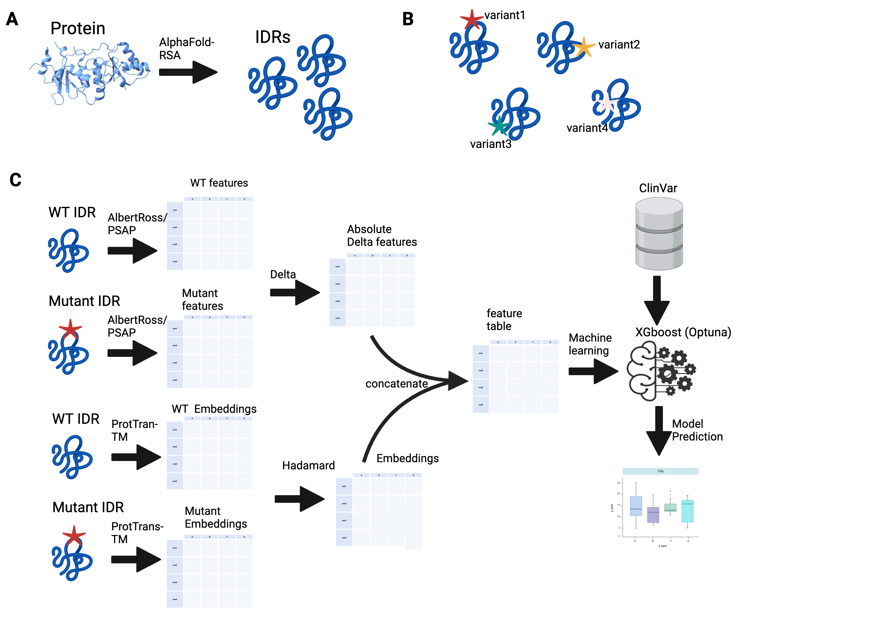

# IFP-MIDR
Improving Functional Prediction of Missense Variants in Intrinsically Disordered Regions (IDR)

## Methodology
The repo contains the code used to develop a framework that integrates features that are predictive of phase separation, global IDR conformation and the hadmard product of the protien embeddings from the wild-type and reference

